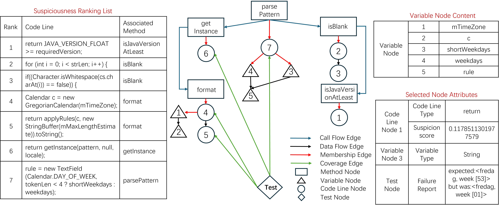
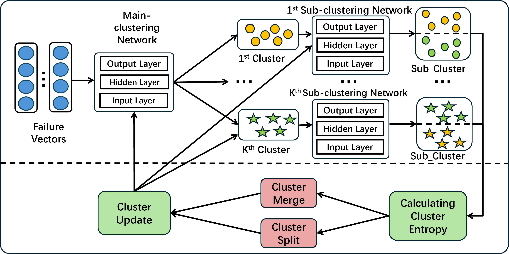

# GREClue
A PyTorch Implementation of paper "GREClue: Failure Indexing with Graph-based Failure Representation and Entropy-based Deep Clustering". 

## Introduction
Failure indexing aims to group multiple failures according to their root causes and is an essential step in parallel debugging. Failure indexing consists mainly of two steps: failure representation and failure clustering. While many research efforts have been devoted to these two steps, serious issues still exist. For failure representation, existing works use coverage or program memory information, which unfortunately can not capture deep failure semantic. For failure clustering, advanced failure indexing methods use clustering algorithms with preset cluster centers, but this kind of clustering algorithm can handle circular clusters well but performs poorly when handling clusters of other shapes. To address these issues, this paper propose GREClue, a novel failure indexing approach with Graph-based failure Representation and Entropy-based deep Clustering. GREClue overcomes the issues in order. For failure representation, GREClue designs the failure semantic graph (FSG), a new graph representation that effectively contains semantic information and runtime information of failures.
<div align=center></div>
Based on the FSG, GREClue further consists of an entropy-based deep clustering component, which can accurately cluster failed tests without presetting cluster centers. An extensive evaluation has been conducted to evaluate GREClue, and the results show that compared to the state-of-the-art failure indexing method, GREClue improves both the performance of estimating the number of faults and the clustering effectiveness by 10% to 41%. Moreover, it has also been shown that GREClue can effectively facilitate parallel debugging.
<div align=center></div>

## Folder Structure
Here we list the descriptions of the folders.
```
 ├── FSG: the code of FSG
     ├──FSG/Defects4J-Multifault: the code of generating Failure Semantic Graphs for a Java programs in Defects4J-Multifault
     ├──FSG/SIR: the code of generating Failure Semantic Graphs for a C programs in SIR
 ├── Entropy_based_clustering: the code of Entropy-based cluster
 ├── K-medoids: the code of K-medoids
```
## Requirements
* Conda
  * install conda: Please refer to the [conda official website](https://conda.io/projects/conda/en/latest/user-guide/install/index.html)
  * Create a new conda environment:
      * if you are running with GPU: 
        ```
        conda env create -f environment-gpu.yml
        conda activate GREClue
        ```
        Dependencies include support for CUDA_11.4. If you are using a different CUDA version update the dependencies accordingly.
      * if you are running with CPU:   
        ```
        conda env create -f environment-cpu.yml
        conda activate GREClue
* Dependency
  * Python >= 3.8
  * Pytorch >= 1.5.0
  * Transformers>=4.10.0
  * tree_sitter 
  * Numpy
  * Scikit-learn
  * pathlib
## Dataset
* Defects4J-Multifault data is obtained from https://github.com/SURE-Repo/SURE/tree/main/Faulty_Program/Defects4J
  
  * Defects4J-Multifault contains five Java projects from [Defects4J](https://github.com/rjust/defects4j): *Chart*, *Closure*, *Lang*, *Math*, and *Time*. The multi-fault version is generated by searching for 1-bug, 2-bugs, 3-bugs, 4-bugs, and 5-bugs. The specific search strategy is as follows:

    `"Searching for Multi-Fault Programs in Defects4J", Gabin An, Juyeon Yoon, Shin Yoo, SSBSE 2021`
    
    Please refer to the [tool link](https://github.com/coinse/Defects4J-multifault) for specific operations.
* SIR data be obtained from https://github.com/SURE-Repo/SURE/tree/main/Faulty_Program/SIR
  
  * SIR data contains four C projects from [SIR](https://sir.csc.ncsu.edu/portal/index.php): *flex*, *grep*, *gzip*, and *sed*. Then, faulty versions with 1-bug, 2-bug, 3-bug, 4-bug, and 5-bug were created based on a mutation strategy. The mutation strategy refers to an existing tool [yisongy/mutate.py](https://github.com/yisongy/mutate.py)(This is a simple script to perform mutation testing on c/c++ like programs) to perform mutation.

## Experiment
Our evaluation is performed on an Ubuntu 22.04.5 server equipped with two RTX A6000 GPUs.

### RQ1 Parameter Analysis
We studied the impact of different selection ranges of the suspiciousness ranking list on the results.

(1) We first obtain the suspiciousness ranking lists:

  * We use tools such as gzoltaragent.jar and gzoltarcli.jar to obtain the suspiciousness ranking list of Java code in Defects4J-Multifault.
    
      Please refer to the [tool link](https://github.com/Instein98/D4jOchiai) for specific operations. 
      
  * We use tools such as gcov and STImpL to obtain the suspiciousness ranking list of C code in SIR.
    
      Please refer to the [tool link](https://sir.csc.ncsu.edu/content/c-overall.php) for specific operations.
    
(2) We select different ranges of content from the suspiciousness ranking list to feed the model and observe the model results.
  ```
  python range.py /path/to/dir --head ranges_of_content --out /path/to/outdir
  ```
### RQ2 Model Effectiveness
After determining the scope of the suspiciousness ranking list, we need to obtain the FSG of the faulty code.
We generate FSG for Defects4J-Multifault using the following command:
  ```
python /FSG/Defects4J-Multifault/step1.py   --project /path/of/java/projects   --locs /path/of/suspiciousnesslist.csv   --txtout /path/of/result.txt
python /FSG/Defects4J-Multifault/step2.py   --project /path/of/java/projects   --locs /path/of/suspiciousnesslist.csv  --txtout /path/of/result.txt
javac /FSG/Defects4J-Multifault/step3/semanticmodel/Activator.java
python /FSG/Defects4J-Multifault/step4.py   --method_graph /path/to/method_graph.txt   --codeline_flow /path/to/codeline_flow.txt   --var_dir /path/to/var_dir   --testfile /path/to/testcase.txt   --out /path/to/merged.txt
  ```
We generate FSG for SIR using the following command:
  ```
python /FSG/SIR/step1.py   --project /path/of/java/projects   --locs /path/of/suspiciousnesslist.csv   --txtout /path/of/result.txt
python /FSG/SIR/step2.py   --project /path/of/java/projects   --locs /path/of/suspiciousnesslist.csv  --txtout /path/of/result.txt
python /FSG/SIR/step3.py   --in_dir /path/to/lines_in --out_dir /path/to/flows_out
python /FSG/SIR/step4.py   --method_graph /path/to/method_graph.txt   --codeline_flow /path/to/codeline_flow.txt   --var_dir /path/to/var_dir   --testfile /path/to/testcase.txt   --out /path/to/merged.txt
 ```
Based on the obtained FSG, we train the entropy-based clustering model.
  ```
  python Entropy_based_clustering/GREClue_code.py
  ```
After obtaining 30 randomly split results, we used the *mannwhitneyu()* method in the *stats* package to perform the Mann-Whitney-Wilcoxon test and the *rank_compare_2indep()* method in the *nonparametric* package to perform the A-test.
### RQ3 Impact Analysis
In the ablation experiment, we start with the full approach, then remove specific parts separately and observe the results after removal.
* (1)GREClue-Suspicion_List: We replace GREClue with GREClue-Suspicion_List, which only inputs the sequence features of suspiciousness ranking lists into the entropy-based deep clustering model.
  Please replace the "build_items_from_raw" method in "Entropy-Based cluster/GREClue_code.py" with the following:
```
def build_items_linear(seq_lists: List[List[str]], graphs: List[Dict[str, Any]],labels: List[int],sep: str = " [SEP] ") -> List[Dict[str, Any]]:
    assert len(seq_lists) == len(graphs) == len(labels), "length mismatch among inputs"
    items = []
    for seq, g, y in zip(seq_lists, graphs, labels):
        seq_part = sep.join(s for s in seq if isinstance(s, str) and s.strip() != "")
        nodes = g.get("global_nodes", []) or []
        edges = g.get("edges", []) or []
        nodes_str = " ".join(
            json.dumps(n, ensure_ascii=False, separators=(",", ":"))
            for n in nodes
        )
        edge_tokens = []
        for e in edges:
            if isinstance(e, (list, tuple)) and len(e) == 2:
                edge_tokens.append(f"{e[0]}->{e[1]}")
            else:
                edge_tokens.append(json.dumps(e, ensure_ascii=False, separators=(",", ":")))
        edges_str = " ".join(edge_tokens)
        graph_part = sep.join(["[NODES]", nodes_str if nodes_str else "<EMPTY>","[EDGES]", edges_str if edges_str else "<EMPTY>",])
        full_text = sep.join([seq_part, graph_part]) if seq_part else graph_part
        items.append({
            "seq_text": full_text,
            "label": y if y is not None else -1,
        })
    return items
  ```
* (2)GREClue-K-medoids: We replace GREClue with GREClue-K-medoids, which first predicts the number of clusters using the data point density estimation method and then performs clustering using K-medoids.
  ```
  python K-medoids/pipeline.py --data_dir data --k 3 --model bigcode/starcoder2-3b --ra 1.0 --rb 1.5
  ```
* (3)GREClue-RMALL: We replace GREClue with GREClue-RMALL, which removes FSG and entropy-based deep clustering method, and uses K-medoids for clustering.
  ```
  Delete lines 53-57 and 66-68 in /K-medoids/pipeline.py and replace line 69 -> z=s_vec
  ```
### RQ4 Parallel Debugging Effectiveness
We simulate the parallel debugging process based on the results of the failure indexing approaches.

(1) cluster the failing tests according to the results of the failure indexing approaches.
  ```
  python Entropy_based_clustering/GREClue_code.py
  ```
(2) each cluster of failed tests and all passed tests form the corresponding test suite.

(3) generate a corresponding suspiciousness ranking list for each test suite.

(4) fix the faulty code for each suspiciousness ranking list in parallel and calculate the parallel debugging cost
  ```
python debugging_cost.py   --sus sus.csv   --label label.csv
  ```
